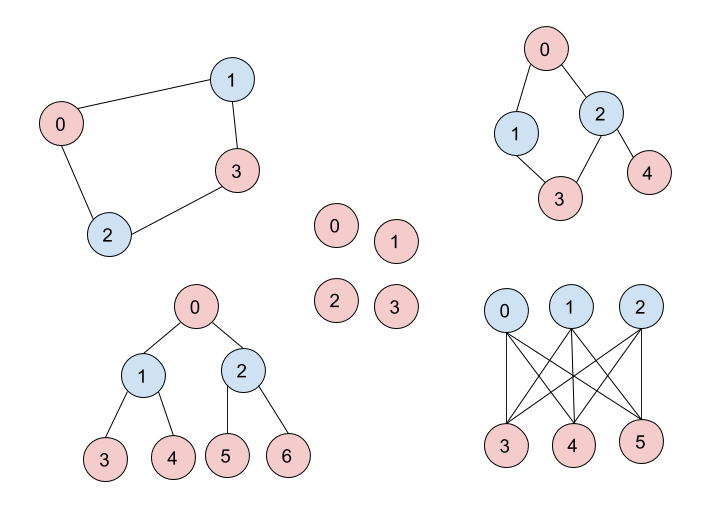
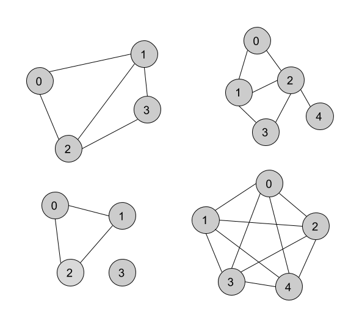

# Homework 5: Graphs

* [Due Dates](#due-dates)
* [Read Me Before Starting](#read-me-before-starting)
* [Q1: Graph Coloring (DFS)](#q1-graph-coloring-bfs)
* [Q2: Runtime](#q2-runtime)
* [Q3: Graph Coloring (BFS)](#q3-graph-coloring-dfs-optional)

## Due Dates
|   Section   |    Date    | Time (Eastern) |
|:-----------:|:----------:|:--------------:|
| Lecture 002 | 10/22/2020 | 12:44pm        |
| Lecture 004 | 10/22/2020 | 12:44pm        |
| Lecture 006 | 10/22/2020 | 05:29pm        |

## Read Me Before Starting
This homework covers topcs from week 7, specifically traversals on undirected
graphs. We will continue covering graph algorithms into HW 6 and 7.

In this homework, we'll be using a lightweight adjacency matrix representation
in `Graph.java`. There are no values in each node and getting the neighbors is a
bit slow. We will change this representation in the future, but for now,
it's sufficient for our purpose. It has the following methods:

* `getVertices()`, which returns all the vertices as a list of integers
* `getNeighbors(int vertex)`, which returns the neighbors of the specified
  vertex 

## Q1: Graph Coloring (BFS)
Given a graph, we want to color all of its nodes either red or blue. The rule is
that no two blue nodes can share an edge, and no two red nodes can share an
edge. Here are some examples:

On the other hand, here are examples of graphs where it's impossible to color
graphs by this rule:

Write a method `canColor` which takes in a Graph and returns true if this graph
can be colored following the rule above and false otherwise. You must use a BFS
traversal (i.e. use a queue) to receive credit.

## Q2. Runtime
In `runtime.txt`, answer the following:

1. What is the runtime of `getNeighbors`?
2. What's the runtime of `canColor`?

**Be sure to define n and explain your reasoning.**

## Q3. Graph Coloring (DFS) (Optional)
**This question is optional and is worth extra credit.**
Create `Coloring2.java` and write a `canColor` method in that class which does
exactly the same thing as the previous method, but uses a recursive DFS instead.

