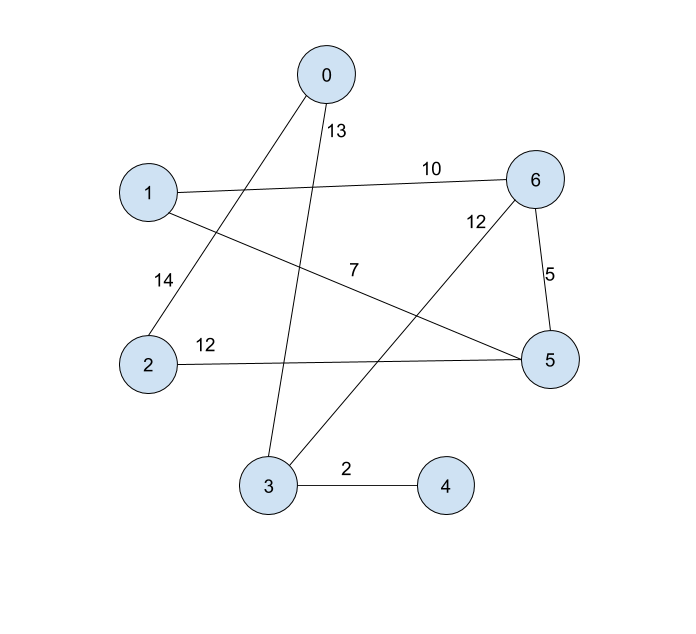

[](https://classroom.github.com/online_ide?assignment_repo_id=3472033&assignment_repo_type=AssignmentRepo)
# Homework 6: Dijkstra's

* [Due Dates](#due-dates)
* [Read Me Before Starting](#read-me-before-starting)
* [Q1: Adjacency List](#q1-graph-coloring-bfs)
* [Q2: Drawing](#q2-drawing)
* [Q3: Dijkstra's `dist`](#q3-dijkstras-dist)
* [Q4: Dijkstra's `prev`](#q4-dijkstras-prev-optional)

## Due Dates
|   Section   |    Date    | Time (Eastern) |
|:-----------:|:----------:|:--------------:|
| Lecture 002 | 10/29/2020 | 11:59pm        |
| Lecture 004 | 10/29/2020 | 11:59pm        |
| Lecture 006 | 10/29/2020 | 11:59pm        |


## Read Me Before Starting
This homework covers topcs from week 9--weighted graphs and Dijkstra's.

**This homework requires no coding,** but please read the instructions in each
question carefully so that you can receive credit (and so grading your
submission is easy!)

Similar HW3.1, we will generate a unique adjacency matrix for each student based
on their Panther ID. In `HW6.java`, replace `null` in `pantherID` with a string
of your Panther ID.

Then when you compile and run HW6, you should get output that looks similar to
this:
```
$ rm *.class; javac *.java; java HW6
Your adjacency matrix:
[null, null,   14,   13, null, null, null]
[null, null, null, null, null,    7,   10]
[  14, null, null, null, null,   12, null]
[  13, null, null, null,    2, null,   12]
[null, null, null,    2, null, null, null]
[null,    7,   12, null, null, null,    5]
[null,   10, null,   12, null,    5, null]
Run Dijktra's starting at node 0
```
**Answer the following questions based on this undirected graph.**


## Q1: Adjacency List
Take the generated adjacency matrix and translate it into an adjacency list.
We provide a template in `answers.txt` that you must follow for full credit.
For example, the answer for the example graph above would look like this:
```
== START LIST ==
0: [(2, 14), (3, 13)]
1: [(5, 7), (6, 10)]
2: [(0, 14), (5, 12)]
3: [(0, 13), (4, 2), (6, 12)]
4: [(3, 2)]
5: [(1, 7), (2, 12), (6, 5)]
6: [(1, 10), (3, 12), (5, 5)]
== END LIST ==
```

## Q2. Drawing
Represent your graph as a picture. I recommend using Google Drawings for this.
I've provided [a template](https://docs.google.com/drawings/d/1VFZ5B8ZqA6BHu4v1hyZekrltXcd3Y71mltjAlDyqnmY/edit?usp=sharing)
that you can make a copy of and use. For example, the answer to the example
graph would look like this:


## Q3. Dijkstra's `dist`
Now we manually run Dijkstra's on your graph starting at the node described by
your output ("Run Dijktra's starting at node 0"). Record the changes of `dist`
as you run this algorithm into `answer.txt`.
* Note that your starting node may be different depending on your Panther ID.
* **Every time you visit a neighbor (regardless of whether
you update `dist`), you should add a row to your answer.**
For example, here is the answer for the example graph:
```
== START DIST ==
[inf, inf, inf, inf, inf, inf, inf] // (initial)
[0, inf, inf, inf, inf, inf, inf]   // (setting dist[s] = 0
[0, inf, 14, inf, inf, inf, inf]    // (0 <-> 2 edge)
[0, inf, 14, 13, inf, inf, inf]     // (0 <-> 3 edge)
[0, inf, 14, 13, inf, inf, inf]     // (3 <-> 0 edge)
[0, inf, 14, 13, 15, inf, inf]      // (3 <-> 4 edge)
[0, inf, 14, 13, 15, inf, 25]       // (3 <-> 5 edge)
[0, inf, 14, 13, 15, inf, 25]       // (2 <-> 0 edge)
[0, inf, 14, 13, 15, 26, 25]        // (2 <-> 5 edge)
[0, inf, 14, 13, 15, 26, 25]        // (4 <-> 3 edge)
[0, 35, 14, 13, 15, 26, 25]         // (6 <-> 1 edge)
[0, 35, 14, 13, 15, 26, 25]         // (6 <-> 3 edge)
[0, 35, 14, 13, 15, 26, 25]         // (6 <-> 5 edge)
[0, 33, 14, 13, 15, 26, 25]         // (5 <-> 1 edge)
[0, 33, 14, 13, 15, 26, 25]         // (5 <-> 2 edge)
[0, 33, 14, 13, 15, 26, 25]         // (5 <-> 6 edge)
== END DIST ==
```

**Note:** Like in class, we visit the neighbor with the smallest label first.

## Q4. Dijkstra's `prev` (Optional)
**This question is optional and worth extra credit.**
Now we manually run Dijkstra's on your graph. Record the changes of `prev` as
you run this algorithm. **Every time you visit a neighbor (regardless of whether
you update `prev`), you should add a row to your answer.** 
